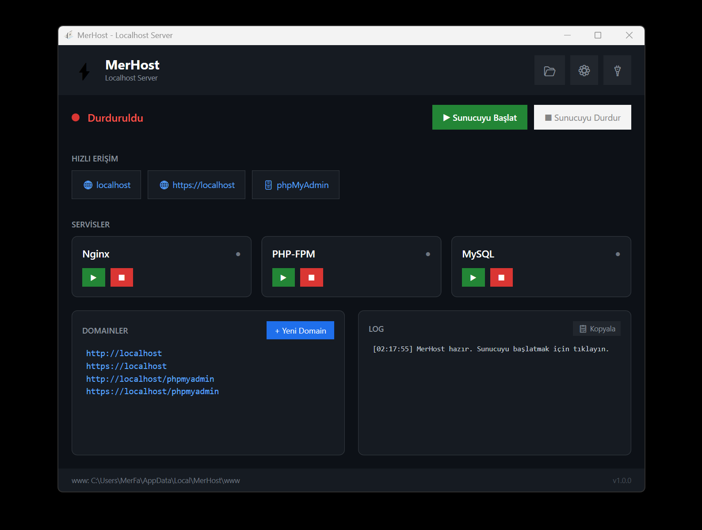
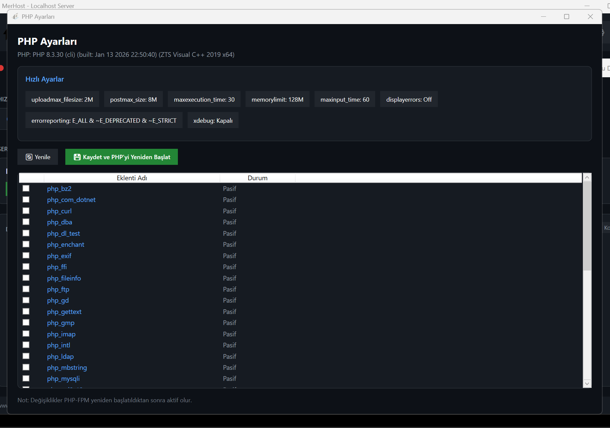

# MerHost - Fast Localhost Server

MerHost, Windows için geliştirilmiş, performans odaklı bir localhost sunucu çözümüdür. Nginx, PHP-FPM ve MariaDB'yi tek bir uygulamada birleştirir.

## Özellikler

- ⚡ **Hızlı Kurulum** - Tek tıkla tüm sunucuları kur
- 🔒 **Otomatik SSL** - Her domain için otomatik sertifika oluşturma
- 🗄️ **phpMyAdmin** - Veritabanı yönetimi kolaylığı
- 🎯 **Virtual Hosts** - Manuel domain oluşturma
- ⚙️ **PHP Ayarları** - Hızlı PHP yapılandırma ayarları
- 🎨 **Modern UI** - Karanlık temalı modern arayüz
- 🔌 **Sistem Tray** - Arka planda çalışma desteği

## Ekran Görüntüleri





## Kurulum

1. `MerHost-Setup-1.0.0.exe` dosyasını indirin
2. Kurulumu çalıştırın
3. Uygulamayı başlatın

## Sistem Gereksinimleri

- Windows 10/11 (64-bit)
- .NET 8.0 Runtime (kurulum paketinde mevcut)

## Kullanım

1. **Sunucuyu Başlat** - Tüm servisleri (Nginx, PHP, MySQL) tek tıkla başlatır
2. **Domain Oluştur** - Yeni bir proje için domain oluşturun
3. **Proje Klasörü** - `www` klasörüne projelerinizi ekleyin

## Varsayılan Portlar

- HTTP: 80
- HTTPS: 443
- MySQL: 3306
- PHP-FPM: 9000

## PHP Hızlı Ayarlar

- `upload_max_filesize` - Dosya yükleme limiti
- `post_max_size` - POST veri limiti
- `max_execution_time` - Max çalışma süresi
- `memory_limit` - Bellek limiti
- `xdebug` - Xdebug eklentisi

## www Klasörü Yapısı

```
www/
├── proje1/       # proje1.test
├── proje2/       # proje2.test
└── ...
```

## Lisans

MIT License

## Yazar

**Kingofa.com**

---

MerHost - Kendi localhost sunucun, kendi kuralların!
